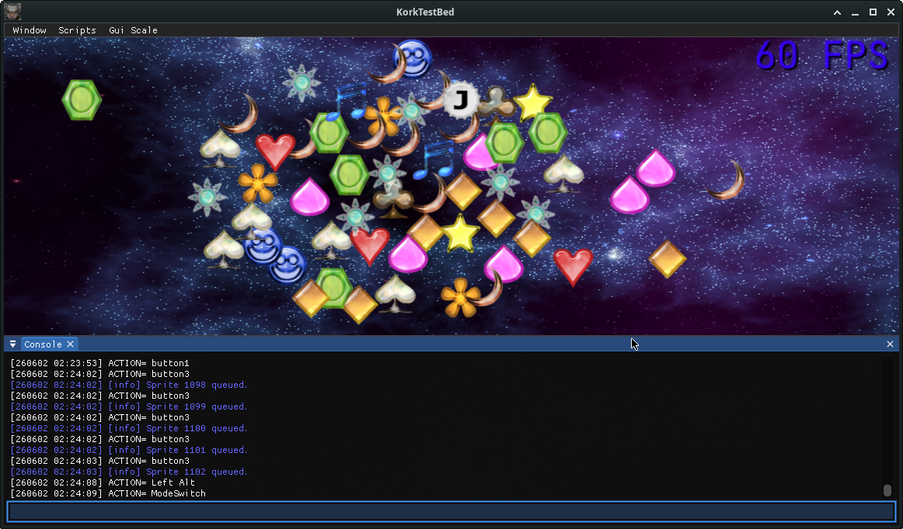

# 🌶️ Ohmflux KorkScript implementation

Using: <a href="https://github.com/ohmtal/korkscript">https://github.com/ohmtal/korkscript</a> based on the great work by James: <a href="https://github.com/jamesu/korkscript"> https://github.com/jamesu/korkscript </a> 

korkscript is am embeddable scripting language based on TorqueScript. It is intended for use in videogames and other related software written in C++.

---

## development Gui 
- ImGui Console: testing code snippets, modify objects and see or copy  the log entries
- Scripts are looked up in assets for (re)loading via Menu. 
- May also add an script editor but not sure about this, because external Tools are more powerful.

## template.cs 
Objects Demo:
- GameCtrl
- Texture
- Font
- Label
- Sprite
- AudioProfile

Show how to:
- Input: Right click to add a Sprite. 
- scrolling FPS via looping schedule 
- FPS Label color "rainbow" animated using GameCtrl's onUpdate.

